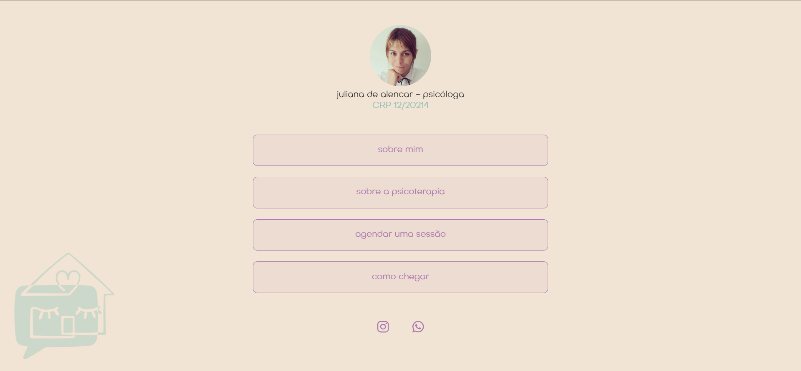
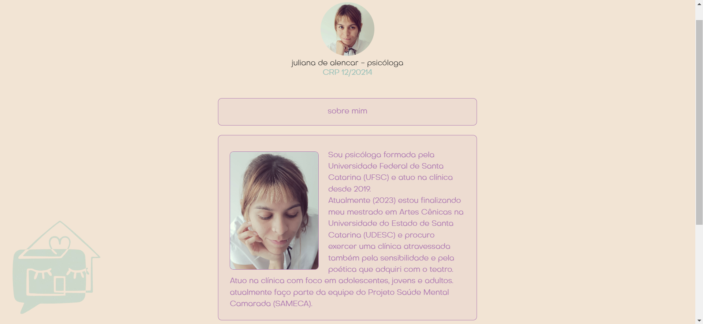
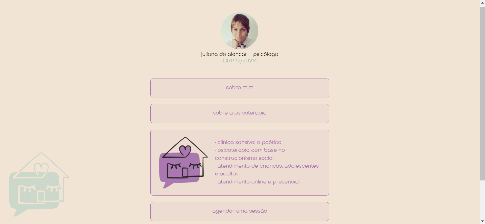
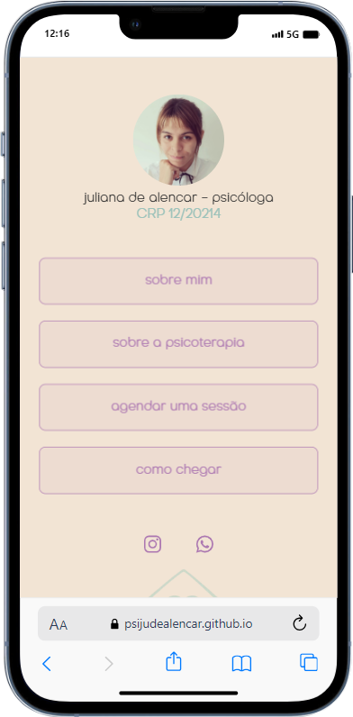
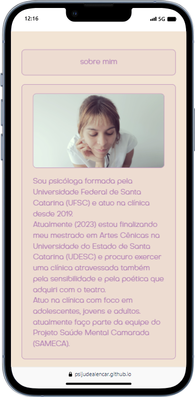
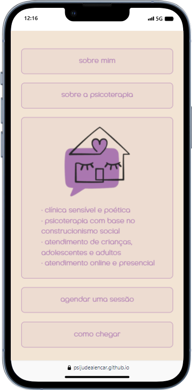
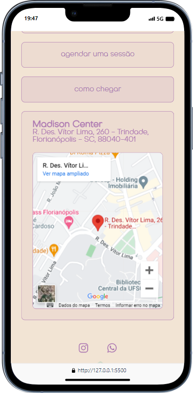

# LinkTree-Style Website para Psicóloga

Este é um projeto que consiste em um site estilo Linktree desenvolvido para promover os serviços da sua amiga psicóloga. O objetivo deste README é fornecer uma visão geral do projeto, instruções de uso e informações adicionais relevantes.

## Visão Geral

O LinkTree-Style Website para Psicóloga é uma plataforma que permite à sua amiga psicóloga compartilhar informações importantes, como seu currículo, serviços oferecidos, contatos, e links para suas redes sociais e artigos relevantes. A página inicial apresenta um design simples e intuitivo, facilitando a navegação dos visitantes.

## Recursos

- **Página Inicial:** Apresenta nome e foto da psicóloga junto ao seu CRP além de botões para as seções principais do site.
- **Sobre mim:** Uma seção onde a psióloga pôde compartilhar sua biografia, formação acadêmica e experiência profissional junto de uma foto.
- **Serviços:** Aqui, os visitantes podem encontrar informações detalhadas sobre os serviços de psicologia oferecidos.
- **Contato:** Link direto para contato via WhatsApp com a psicóloga.
- **Redes Sociais:** Links para as redes sociais da psicóloga, permitindo que os visitantes a sigam nas plataformas relevantes.

## Capturas de Tela

## Versão Mobile

## Tecnologias Utilizadas

- HTML
- CSS# linktreestylesite
- JavaScript